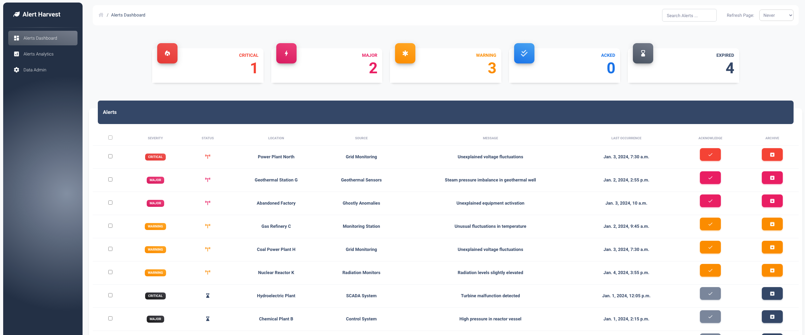
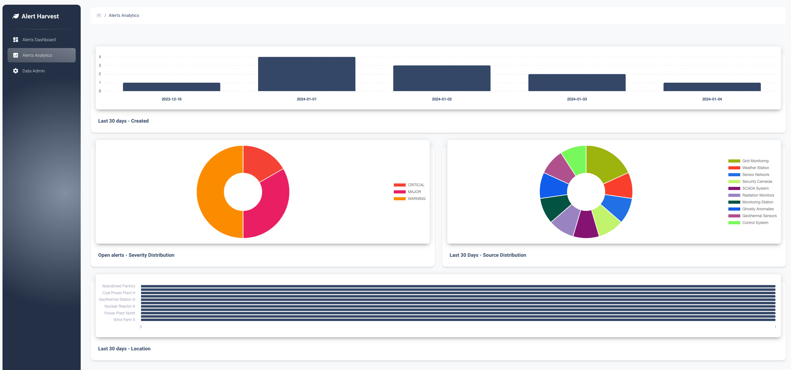

# Alert Harvest

A new way of aggregating and dispatching monitoring alerts.
From any source to any target with a neat single pane of glass in the middle.

## Support and contribute

For support and contribution join our [discord](https://discord.gg/hduVhv7VaA)

## Tech Stack

**Backend**
- 
- 
- 
- 

**Frontend**
- 
- 

**Automation**
- 

## Deployment

To deploy this project run

```bash
  docker compose up -d
```
Once the deployment is successful, you can access the dashboard at [http://127.0.0.1:8000/viz/dashboard/](http://127.0.0.1:8000/viz/dashboard/).

Default Django admin credentials:

- Username: admin
- Password: Welcome2Harvest

## Screenshots




## API Reference

### Create Alert

`POST /api/create_alert/`

| Parameter    | Type     | Description                               |
| :----------- | :------- | :---------------------------------------- |
| `location`   | `string` | **Required**. Location of the alert.      |
| `severity`   | `string` | **Required**. Severity of the alert.      |
| `message`    | `string` | **Required**. Message for the alert.      |
| `source`     | `string` | **Required**. Source of the alert.        |
| `timestamp`  | `string` | **Required**. Timestamp of the alert.     |

#### Response

- Success:

  ```json
  {"status": "success", "message": "Alert received and saved."}
  ```

- Error:

  ```json
  {"status": "error", "message": "Error details here."}
  ```

---

### Close Alert

`PUT /api/close_alert/${alert_id}`

| Parameter   | Type     | Description                       |
| :---------- | :------- | :-------------------------------- |
| `alert_id`  | `int`    | **Required**. ID of the alert to close |

#### Response

- Success:

  ```json
  {"status": "success", "message": "Alert closed successfully"}
  ```

- Error:

  ```json
  {"status": "error", "message": "Error details here."}
  ```

---

### Close Alerts in Bulk

`PUT /api/close_alerts_bulk/`

| Parameter      | Type       | Description                                     |
| :------------- | :--------- | :---------------------------------------------- |
| `alert_ids`    | `list[int]`| **Required**. List of alert IDs to close in bulk |

#### Request Body Example

```json
{
  "alert_ids": [1, 2, 3]
}
```

#### Response

- Success:

  ```json
  {"status": "success", "message": "Alerts closed successfully"}
  ```

- Error:

  ```json
  {"status": "error", "message": "Error details here."}
  ```

---

### Close Expired Alerts

`PUT /api/close_expired_alerts/`

#### Response

- Success:

  ```json
  {"status": "success", "message": "Expired alerts closed successfully"}
  ```

- No Expired Alerts:

  ```json
  {"status": "success", "message": "No expired alerts found"}
  ```

- Error:

  ```json
  {"status": "error", "message": "Error details here."}
  ```

---

### Acknowledge Alert

`PUT /api/acknowledge_alert/${alert_id}`

| Parameter   | Type     | Description                           |
| :---------- | :------- | :------------------------------------ |
| `alert_id`  | `int`    | **Required**. ID of the alert to acknowledge |

#### Response

- Success:

  ```json
  {"status": "success", "message": "Alert acknowledged successfully"}
  ```

- Error:

  ```json
  {"status": "error", "message": "Error details here."}
  ```

---

### Acknowledge Alerts in Bulk

`PUT /api/acknowledge_alerts_bulk/`

| Parameter      | Type       | Description                                           |
| :------------- | :--------- | :---------------------------------------------------- |
| `alert_ids`    | `list[int]`| **Required**. List of alert IDs to acknowledge in bulk |

#### Request Body Example

```json
{
  "alert_ids": [1, 2, 3]
}
```

#### Response

- Success:

  ```json
  {"status": "success", "message": "Alerts acknowledged successfully"}
  ```

- Error:

  ```json
  {"status": "error", "message": "Error details here."}
  ```

---

### Unacknowledge Alert

`PUT /api/unacknowledge_alert/${alert_id}`

| Parameter   | Type     | Description                             |
| :---------- | :------- | :-------------------------------------- |
| `alert_id`  | `int`    | **Required**. ID of the alert to unacknowledge |

#### Response

- Success:

  ```json
  {"status": "success", "message": "Alert unacknowledged successfully"}
  ```

- Error:

  ```json
  {"status": "error", "message": "Error details here."}
  ```

## Notitications

To be detailed with examples but for now creates rules following the exampel in rules.json
Create modules following example.
Discord module is active and running.

